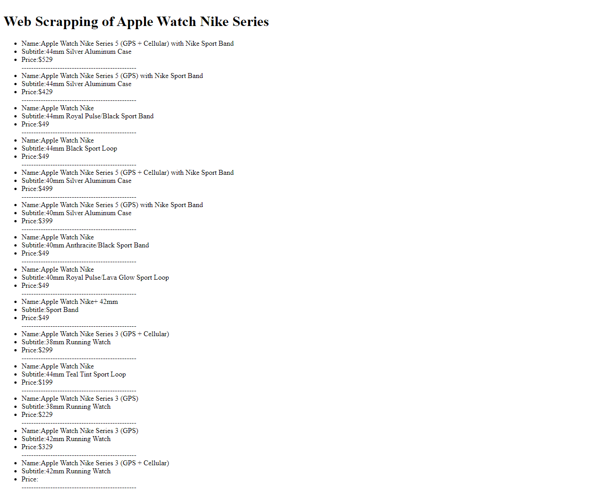

# Web Scraping With Ruby and Nokogiri


# Table of Content


* [About the Project](https://github.com/mihrab34/ruby-web-scrapper/blob/development/README.md#about-the-project)
* [Technology and Dependencies](https://github.com/mihrab34/ruby-web-scrapper/blob/development/README.md#technology-and-dependencies)
* [Requirements](https://github.com/mihrab34/ruby-web-scrapper/blob/development/README.md#requirements)
* [Setup and Installations](https://github.com/mihrab34/ruby-web-scrapper/blob/development/README.md#setup-and-installations)
* [Author](https://github.com/mihrab34/ruby-web-scrapper/blob/development/README.md#author)
* [Contribution](https://github.com/mihrab34/ruby-web-scrapper/blob/development/README.md#contribution)

# About the Project

This project is a capstone project which is the part of new adjustments in [Microverse](https://www.microverse.org/) curriculum. It is a solo project done at the end of every course in the technical curriculum. Ruby Language is used to scrape Nike website watch category to get information on product names, title and prices.

> Output displayed on browser  
> 


# Technology and Dependencies

This project was built using these technologies and dependencies.

* Ruby
* Nokogiri gem
* HTTParty gem
* Erubi gem
* Launchy gem
* Rubocop
* Stickler
* Rspec

# Requirements

* Ruby: Ruby must have been downloaded and installed on your computer. Download it [here](https://www.ruby-lang.org/en/downloads/) if it is not available.
* Nokogiri: Gem must be installed on your local system.
* HTTParty: Gem must be installed on your local system.
* Erubi: Gem must be installed on your local system.
* Launchy: Gem must be installed on your local system.

# Setup and Installations

* Install ruby on your computer system.
* Install all the Rubygems dependecies listed in the Gemfile with ``` bundle install ``` or

~~~

gem install nokogiri
gem install httparty
gem install erubi
gem install launchy

~~~

Check out [Ruby gems](https://rubygems.org/) for more information on installing ruby gems.

* Clone the repository and run the app

~~~~

$ git clone git@github.com:mihrab34/ruby-web-scrapper.git
$ cd  ruby-web-scrapper
$ run ruby bin/main.rb to view on terminal and browser automatically
$ run rspec on terminal for testing

~~~~


# Author

[@mihrab34](https://github.com/mihrab34)

# Contributions

Any contributions are **greatly appreciated**

1. Fork the Project
2. Create your Feature Branch ```(git checkout -b feature/AmazingFeature)```
3. Commit your Changes ```(git commit -m 'Add some AmazingFeature')```
4. Push to the Branch ```(git push origin feature/AmazingFeature)```
5. Open a Pull Request